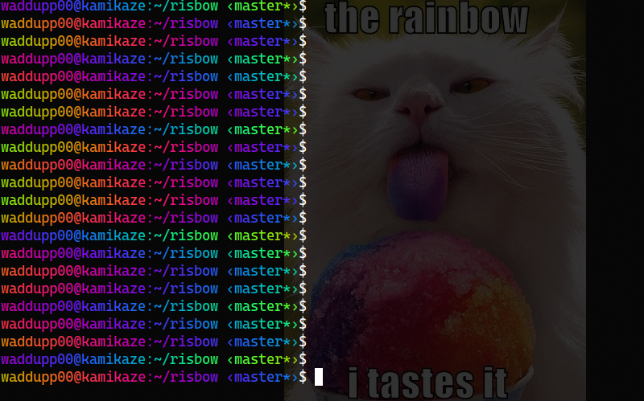

# risbow
A risto inspired zsh theme with a lolcat like rainbow effect

## About

This is basically the ol' reliable risto ran through lolcat, i.e. an recreation of Debian/Ubuntu's default bash prompt (+ the current git branch) with a per-line randomized rainbow effect.

You can easily change what's rainbowized and what's not by tweaking the values of `to_color` and `stay_white`. You can also fiddle with `freq` and `seed` to control how your gradients are generated. By default, they have the same values as in `roflcat`.

Special thanks to romkatv from reddit who gave the code I based myself on !

## Installation

You need to have :
- zsh
- oh my zsh
- a true-color terminal

Put `risbow.zsh-theme` in `$ZSH/custom/themes`, then edit your `~/.zshrc` file so as to have `ZSH_THEME='risbow'`. The new theme will only take effect on new terminal instances.

## Background

I was bored in class, so I started to tinker with my zsh theme. At some point I got the idea of using `lolcat` to rainbowize my prompt. A few hours and [one reddit thread later](https://www.reddit.com/r/zsh/comments/tganw3/redirect_ps1_to_lolcat/), I came up with this solution which is a mix of romkatv's code (you will find it in the reddit thread) [and roflcat's color computing code](https://github.com/jameslzhu/roflcat/blob/master/src/main.rs).

## Wait ... why not just use `lolcat` instead ?

I did manage to code a "naive" solution that used `lolcat`, and the result looked pretty good ... but for some reason, this would break the terminal's text wrapping. This was consistent accross 3(!) different implementations of `lolcat` (the OG one, `lolcat-c` and `roflcat`), and I already spent way too much time on this so I didn't bother finding a fix.
